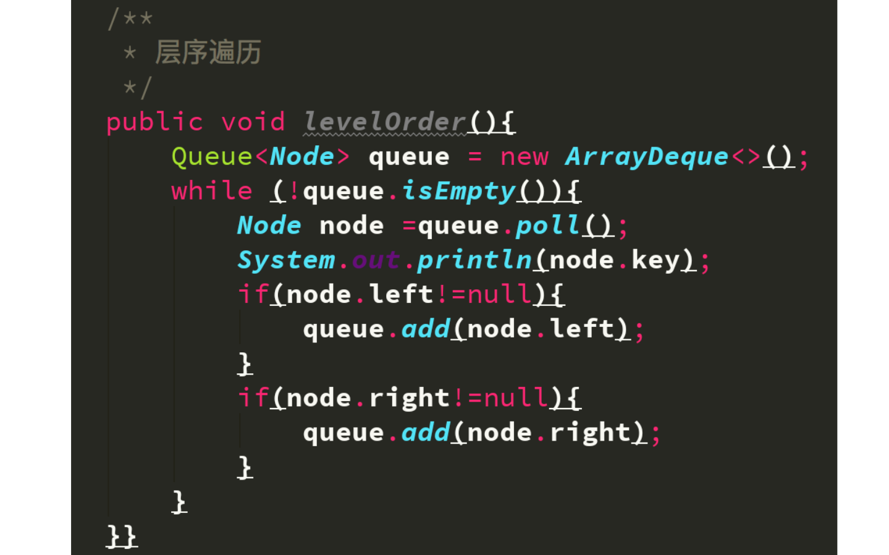

## 二叉树的广度优先遍历

### 一、广度优先的含义

也可称为 **层序遍历**

重点把握：我们首先将每一层的结点优先遍历完毕。

### 二、代码实现

要想完成广度优先遍历，我们要借助 **队列** （先进先出，后进后出）的概念。

**思想** ：当队列中的队首出队的时候，要从二叉树中找到它的两个孩子入队。队列出队为空的时候，就将二叉树遍历完成了。

**步骤**：

1. 将根结点入队（入队的时候不做别的操作）；

2. 队列非空，所以接下来就要出队，规则是：依次出队，只要出队的元素有孩子，左右孩子依次入队，如果没有孩子不做任何操作。

**代码实现**：（可以当成模板函数）

### 三、总结

以下的总结是针对深度优先遍历的3种方式和广度优先的1种方式，总共4种遍历方式而言的：

* **整个遍历的复杂度是：O(n)。每一个结点只访问了常数次。**

* **归并排序和快速排序的本质其实是二叉搜索树的深度优先遍历的过程。**
* 把握思想：
  * 1、递归；
  * 2、使用队列实现一个更加复杂的算法的过程。

### 四、参考

* [liweiwei1419](https://www.yuque.com/liweiwei1419/algo/kmgur5）

