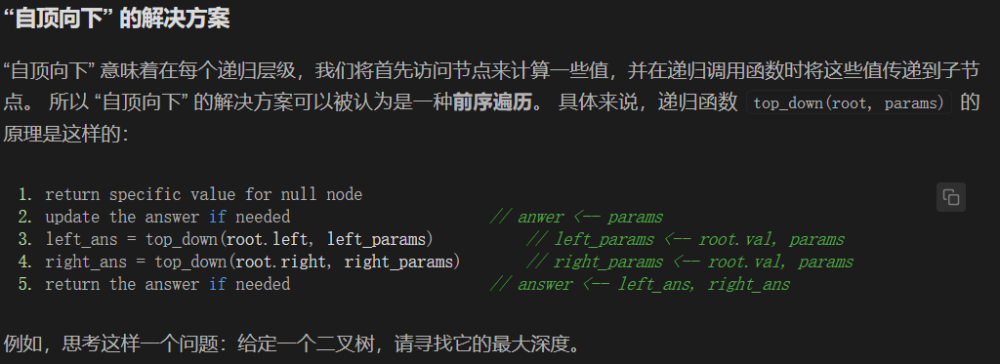

### 一、二叉树的存储

#### 1、链式存储

需要额外的两个指针

#### 2、数组存储

对于非完全二叉树，会浪费内存空间

### 二、二叉树的遍历

一般就3种思路，即递归法、迭代法、Morris解法

#### 1、递归

#### 2、迭代

本质上是在**“手动递归”**，因为在递归的过程中使用了系统栈，所以在迭代的解法中常用**“栈”**数据结构来模拟系统栈 

三种遍历的区别，关键在于入栈出栈的时机    
* **前序遍历**：出栈一个节点，入栈两个节点（右子节点、左子节点依次入栈）    
* **中序遍历**：只要当前节点有左子节点，就入栈（而出栈延迟），直到无左子节点或者左子节点已经遍历过才开始出栈，并将右子节点入栈。另外需要额外记忆曾经遍历过的节点（避免进入死循环）。    
* **后续遍历**：待           

#### 3、Morris（莫里斯）遍历

参考：https://www.cnblogs.com/anniekim/archive/2013/06/15/morristraversal.html

以上这两种方法都是O(n)的空间复杂度 ， **Morris**方法与前两种方法的不同在于该方法只需要O(1)空间，而且同样可以在O(n)时间内完成。 

要使用O(1)空间进行遍历，最大的难点在于，遍历到子节点的时候怎样重新返回到父节点（假设节点中没有指向父节点的p指针），由于不能用栈作为辅助空间。为了解决这个问题，Morris方法用到了[线索二叉树](http://en.wikipedia.org/wiki/Threaded_binary_tree#The_array_of_Inorder_traversal)（threaded binary tree）的概念。在Morris方法中不需要为每个节点额外分配指针指向其前驱（predecessor）和后继节点（successor），只需要利用叶子节点中的左右空指针指向某种顺序遍历下的前驱节点或后继节点就可以了。

### 三、运用递归解决树的问题

[力扣 leetbook](https://leetcode-cn.com/leetbook/read/data-structure-binary-tree/xefb4e/)

#### 1、自顶向下

这个模板建议记忆

#### 2、自底向上

### 四、二叉树 + 动态规划（递归）

这是一类典型的综合题目，考察全面  待补充

树状dp/树形动态规划    vs     线性（一维、多维）动态规划