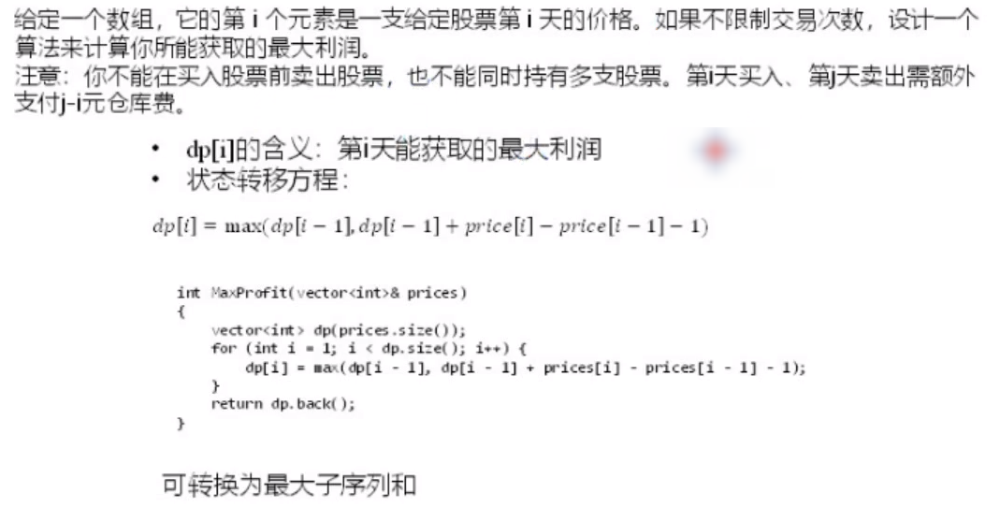
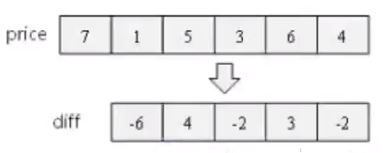

### 122. 买卖股票的最佳时机 II

* **dp[i]的含义**：第i天能获取的最大利润
              

* **状态转移方程**：dp[i] = max(dp[i-1], dp[i-1]+prices[i]-prices[i-1])

  有2种前置状态
                     

  1. 今天比前一天跌了    dp[i-1]
  2. 今天比前一天涨了    dp[i-1]+prices[i]-prices[i-1]

#### 思考

* 看起来此题比 “买卖股票I” 要复杂的多，但是调整dp[i]的含义之后，动态规划方程反而更简单了！

  

* 可转换为最大子序和

  “买卖股买I” 要求只进行一次买卖，本质就是求 “最大子数组和”；
  
  “买卖股票2”可进行多次买卖，相当于求“**最大子序列和**”，只需取diff数组中的所有正数相加即可。
  
  * 子数组 vs 子序列 ：子序列是元素的相对顺序不变，但可以不连续。
  
  ​	
  
  