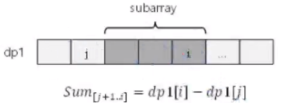
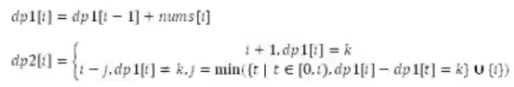
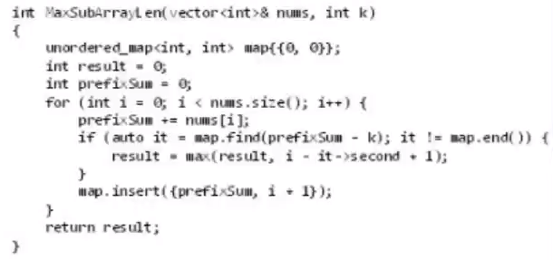

###  325. 和等于 k 的最长子数组长度

#### 动态规划解法

首先做一个转换

将子数组和转换成2个**前序和/前缀和**之差，如下图所示

​			Sum[j+1...i] =  dp1[i] - dp1[j]

这样的转换可降低难度，并适合使用动态规划（**前序和**）

使用2个dp数组

* dp1[i]的含义：[0...i]的元素和
* dp2[i]的含义：以元素i结尾的和为K的子数组的最大长度
* 状态转移方程：

时间复杂度：O(n^2)

​	对于每个i，会在i前面进行一次遍历，所以时间复杂度是n^2

**利用哈希表优化**

dp1[j] = dp1[i] - K

使用哈希表保存前面计算出来的{dp1[t]: t}，即可快速找到满足条件的j

优化之后代码如下，其实已经基本看不出来动态规划的痕迹了

#### 总结

1. 通过这道题最大的收获就是理解**前缀和**数组的作用，利用前缀和能够快速计算子数组的和

2. 使用了2个dp表

