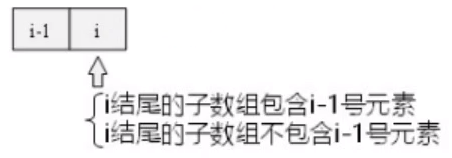

### 最大子序和

这道题比较难想到动态规划解法的入手点，且该题是不少动态规划题的母题。

**类似题目**：

* 力扣 300. 最长递增子序列

**思路**：

**力扣网友的思考**：

来源[力扣](https://leetcode-cn.com/problems/maximum-subarray/solution/xiang-xi-jie-du-dong-tai-gui-hua-de-shi-xian-yi-li/)

示例: [a, b , c, d , e]

解答这类题目, 省略不掉遍历, 因此我们先从遍历方式说起

通常我们遍历子串或者子序列有三种遍历方式

* 以某个节点为开头的所有子序列: 如 [a]，[a, b]，[ a, b, c] ... 再从以 b 为开头的子序列开始遍历 [b] [b, c]。
* 根据子序列的长度为标杆，如先遍历出子序列长度为 1 的子序列，在遍历出长度为 2 的 等等。
* 以子序列的结束节点为基准，先遍历出以某个节点为结束的所有子序列，因为每个节点都可能会是子序列的结束节点，因此要遍历下整个序列，如: 以 b 为结束点的所有子序列: [a , b] [b] 以 c 为结束点的所有子序列: [a, b, c] [b, c] [ c ]。

第一种遍历方式通常用于暴力解法；

第二种遍历方式 leetcode (5. 最长回文子串 ) 中的解法就用到了；

第三种遍历方式 因为可以产生递推关系, 采用动态规划时, 经常通过此种遍历方式, 如 背包问题, 最大公共子串 , 这里的动态规划解法也是以 先遍历出 以某个节点为结束节点的所有子序列 的思路。

对于刚接触动态规划的, 我感觉熟悉第三种遍历方式是需要抓住的核心

因为我们通常的惯性思维是以子序列的开头为基准，先遍历出以 a 为开头的所有子序列，再遍历出以 b 为开头的...但是动态规划为了找到不同子序列之间的递推关系，恰恰是以子序列的结束点为基准的，这点开阔了我们的思路。

> 算法扫描一次整个数列的所有数值，
>
> 在每一个扫描点计算以该点数值为结束点的子数列的最大和（正数和）。
>
>  该子数列由两部分组成：以前一个位置为结束点的最大子数列、该位置的数值。
>
> 因为该算法用到了“最佳子结构”（以每个位置为终点的最大子数列都是基于其前一位置的最大子数列计算得出, 
>
> 该算法可看成动态规划的一个例子。
>
> 状态转移方程：sum[i] = max{sum[i-1]+a[i],a[i]}   
> 其中(sum[i]记录以a[i]为子序列末端的最大序子列连续和)

