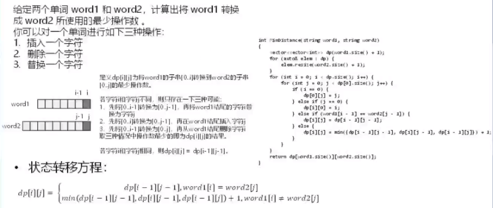

### 72. 编辑距离

* **dp\[i][j]的含义**：

  将word1的子串[0...i]转换到word2的子串[0...j]的最少操作数

  若字符i和字符j不同，则只存在以下三种可能：
  
  1. 先将[0...i-1]转换为[0...j-1]，再将word1结尾的字符i替换为字符j
  
  2. 先将[0...i]转换为[0...j-1]，再在word1结尾插入字符j
  
  3. 先将[0...i-1]转换为[0...j]，再从word1结尾删除字符i
  
     取三种情况中操作数最少的即为dp\[i][j]的结果
  
  若字符i和字符j相同，则dp\[i][j] = dp\[i-1][j-1]
  
* **状态转移方程**：

  见上图