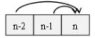

### 使用最小花费爬楼梯

#### 动态规划的思路

这里是来源于w3的解法

dp的含义一定要清晰

* dp[n]的含义：最后一步**落在**第n个阶梯时的最低花费

有2种方法转移到第n个状态，即从n-1走1个台阶到n，或者，从n-2走2个台阶到n

状态转移的开销都是cost[n]

* 状态转移方程：dp[n]=min(dp[n-1], dp[n-2]) + cost[n]

**注意**：该解法的dp含义并非直接是结果，在最后又对dp进行了一次运算才作为结果
            

​			return min(dp[len_cost-1], dp[len_cost-2])

