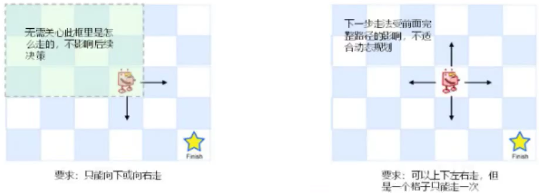
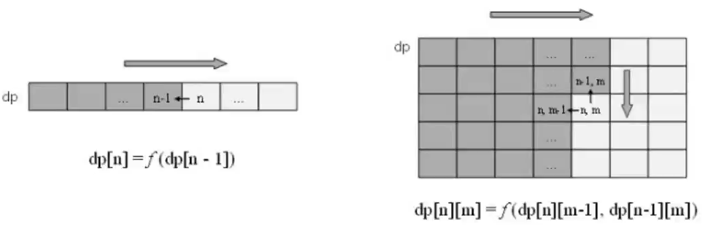
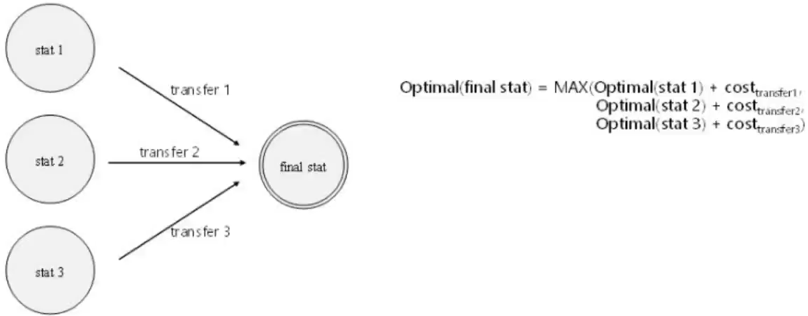

### 动态规划
#### 一、原理
用于解决一大类问题：一个阶段的最优解可以由之前某个（或某些）阶段的最优解得到

**核心思想**：归纳法

​							dp[n] = f(dp[n-i],dp[n-j],...)

* dp是动态规划表

* f是推导的方法

#### 二、解题步骤
1. 确定需要保存在dp表中的状态（**关键！**）
2. 确定当前状态和之前状态之间的递推关系（**状态转移方程**）
3. 填充dp表
   * 自顶向下：使用递归，大问题分解为小问题，dp表充当备忘录（缓存，为了降低时间复杂度）
   * 自底向上：使用迭代，小问题合并为大问题，按依赖顺序进行填充

4. 从dp表中读取最终状态，即结果

#### 三、动态规划类题目的特征

* 能基于子问题最优解得到原问题最优解（最优子结构）

	* 反例：无法划分子问题，或子问题和原问题在最优化过程中会互相制约

* 后续决策不受历史决策过程影响（无后效性）
	* 反例：状态转移方程不仅依赖之前的状态，还依赖到达此状态的步骤

#### 四、dp表

dp表通常使用一个一维或多维数组

**关键**：确定影响状态的维度和每个元素代表的含义

#### 五、状态转移

#### ME的感想

1. **递归与动态规划的关系**：

   递归只是动态规划“自顶向下”的实现手段

2. **关于辅助函数**：

   为了提高自定向下（递归）解法的效率，使用**备忘录**来记忆计算结果，往往会用到辅助函数。

   那么，为何需要使用辅助函数？

   备忘录（dp）需要能在不同递归调用层中共享，要么定义为全局变量，要么定义为类的成员属性，更好的方式是在辅助函数中采用类似C++引用的方式传递(python中列表作为函数参数，是可以实现在函数内改变列表中值的)

#### 经典题目

建议做题顺序同下

* 入门级：

  * 力扣 746. 使用最小花费爬楼梯

  * 力扣 64. 最小路径和

* 母题：

  * 力扣 53.最大子序（ME:应该称子数组）和（不知道怎么用上动态规划）
    
    * 力扣 300. 最长递增子序列
    
  
* 力扣 72.编辑距离

* 力扣 325.和等于 k 的最长子数组长度

* 股票买卖

  * 力扣 121. 买卖股票的最佳时机

    思考此题与 “力扣 53.最大子序和” 的关系

  * 力扣 122. 买卖股票的最佳时机 II

  * 力扣 309. 最佳买卖股票时机含冷冻期

    Me:力扣 198. 打家劫舍  使用的二维dp表与此题类似(想复杂了，其实还有1维的dp表可解)

  * 力扣 188. 买卖股票的最佳时机 IV

* 杨柳疫苗

* 